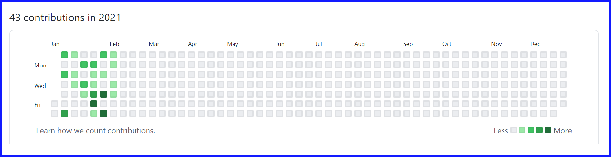
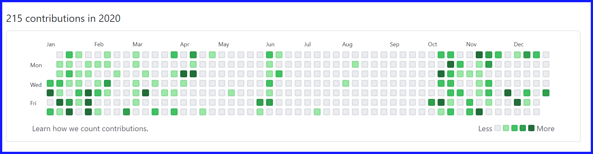
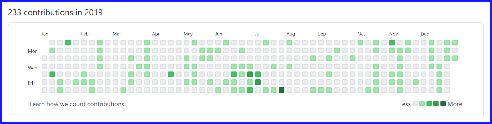
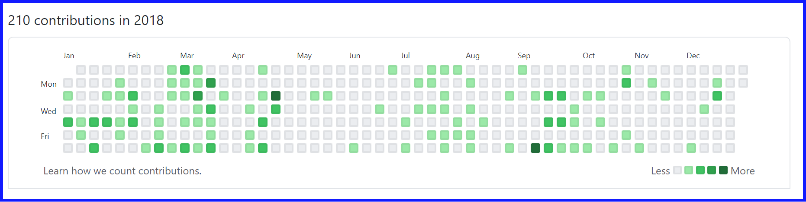
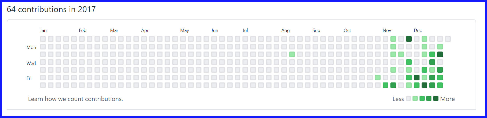

# Geronimo

#### Github History under username Geerooniimoo

## 39 repositories:
* Leaflet-challenge
* Geerooniimoo.io
* D3-Challenge
* python-api-challenge
* pandas-challenge
* plotly-challenge
* SQLAlchemy-Challenge
* Mission_To_Mars
* matplotlib-challenge
* NFL-RECORDS
* heroesmemorygame
* VBA-Scripting
* SQL-Challenge
* infosectechnology
* SpiritualEngineering
* JavaScript-Challenge
* Web-Design-Challenge
* Mission_to_Jupiter
* Password-Generator
* FriendFinder
* Gamazon
* realnewslinks
* HYBC
* New-York-Times-API
* liri-node-app
* WeatherForecast
* GifTastic
* Calender
* crudaburger
* porfolio
* NodeGuessGame
* TrainScheduler
* CristalCollectorGame
* Hangman-Game
* BoxingGame
* Responsive-HYBC
* Bootstrap-Portfolio
* Basic-Portfolio
